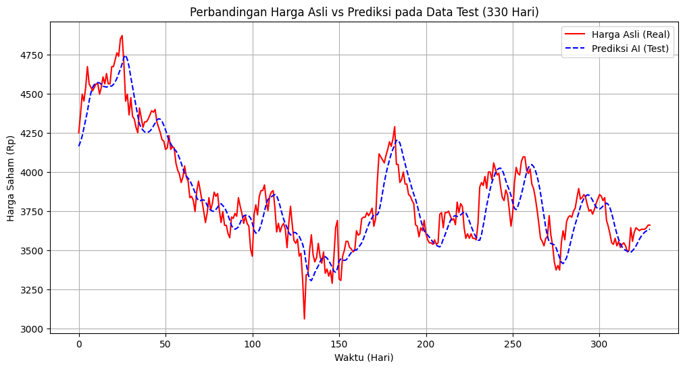

# 📈 BBRI Stock Price Prediction using LSTM


A Time-Series Forecasting project utilizing **Long Short-Term Memory (LSTM)** neural networks to predict the daily closing price of **Bank Rakyat Indonesia (BBRI.JK)** stocks. Built with PyTorch.

## 📌 Project Overview
Predicting stock market trends is challenging due to the volatile and non-linear nature of financial data. This project implements a Deep Learning approach using a Stacked LSTM architecture to capture temporal dependencies in historical stock prices.

The model is trained on historical data (fetched via Yahoo Finance) and is capable of:
1.  Analyzing trends from the past 60 days.
2.  Predicting the closing price for the next trading day (H+1).

## 🧠 Model Architecture
The core of this project is a Recurrent Neural Network (RNN) specialized for sequence prediction:
* **Input:** 60-day sliding window of Normalized Closing Prices.
* **Hidden Layers:** 2 Stacked LSTM Layers (50 units each).
* **Output Layer:** Fully Connected (Linear) Layer.
* **Optimizer:** Adam (`lr=0.001`).
* **Loss Function:** Mean Squared Error (MSE).

## 📂 Project Structure

```bash
├── data/                   # Raw and processed data (csv)
├── models/                 # Saved PyTorch model weights (.pth)
├── notebooks/              # Jupyter Notebooks for step-by-step process
│   ├── 01_data_collection.ipynb    # Fetching data from yfinance
│   ├── 02_data_preprocessing.ipynb # Scaling & Sliding Window logic
│   ├── 03_model_training.ipynb     # Building & Training LSTM
│   └── 04_forecasting.ipynb        # Predicting future price (Real-time)
├── .gitignore
├── README.md
└── requirements.txt
```

## 📊 Results
The model was evaluated using **Root Mean Squared Error (RMSE)** and visual inspection of the test data (20% split).



> **Current Performance:** The model successfully captures major trend reversals and momentum, showing a convergent loss curve during training.

## 🚀 How to Run

### 1. Clone the Repository

```bash
git clone [https://github.com/username/stock-prediction-research.git](https://github.com/username/stock-prediction-research.git)
cd stock-prediction-research
```

### 2. Install Dependencies

```bash
pip install -r requirements.txt
```

### 3. Run the Notebooks
You can run the notebooks in order using VS Code or Jupyter Lab. To see the prediction for tomorrow's price immediately:
* Open `notebooks/04_forecasting.ipynb`
* Run all cells.

## ⚠️ Disclaimer
This project is for **educational and research purposes only**. The predictions generated by this AI model should **NOT** be taken as professional financial advice or a recommendation to buy/sell assets. Always do your own research (DYOR).

## 👤 Author
**Allan**
* Informatics Student & Calculus Assistant Lecturer
* Aspiring AI Engineer