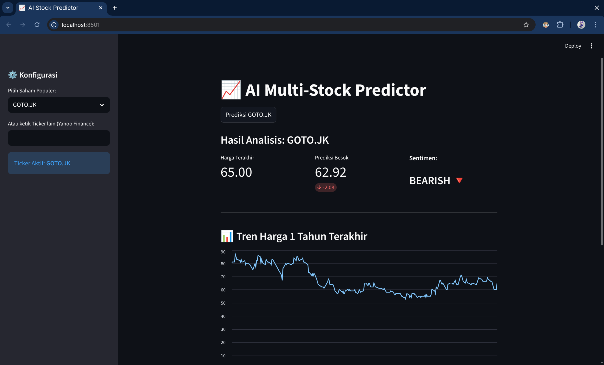

# 📈 AI Multi-Stock Prediction App


A Time-Series Forecasting project utilizing **Long Short-Term Memory (LSTM)** neural networks to predict daily closing prices of **ANY stock** (BBRI, BBCA, AAPL, TSLA, etc.). Now features an interactive web dashboard built with Streamlit.

## 📌 Project Overview

Predicting stock market trends is challenging due to the volatile and non-linear nature of financial data. This project implements a Deep Learning approach using a Stacked LSTM architecture to capture temporal dependencies.

**Key Features:**
* **Multi-Ticker Support:** Predict Indonesian stocks (.JK), US stocks, or Crypto.
* **Interactive Dashboard:** Real-time data fetching and visualization.
* **Deep Learning Core:** Trained on historical data to predict H+1 prices.
* **Trend Analysis:** Visualizes 1-year price history and statistical metrics.

## 🧠 Model Architecture
The core is a Recurrent Neural Network (RNN) specialized for sequence prediction:
* **Input:** 60-day sliding window of Normalized Closing Prices.
* **Hidden Layers:** 2 Stacked LSTM Layers (50 units each).
* **Output Layer:** Fully Connected (Linear) Layer.
* **Optimizer:** Adam (`lr=0.001`).
* **Loss Function:** Mean Squared Error (MSE).

## 📂 Project Structure

```bash
├── assets/                 # Images for documentation
├── data/                   # Raw and processed data (csv)
├── models/                 # Saved PyTorch model weights (.pth)
├── notebooks/              # Jupyter Notebooks for research & training
│   ├── 01_data_collection.ipynb
│   ├── 02_data_preprocessing.ipynb
│   ├── 03_model_training.ipynb     # Run this to retrain the model
│   └── 04_forecasting.ipynb
├── app.py                  # Main Streamlit Web Application
├── .gitignore
├── README.md
└── requirements.txt
```

## 📊 Evaluation
The model was evaluated using **Root Mean Squared Error (RMSE)** on unseen test data (20% split).


> **Performance:** The model demonstrates strong generalization capabilities, effectively capturing trend reversals without significant overfitting.

## 🚀 How to Run

### 1. Clone the Repository

```bash
git clone https://github.com/Anxten/stock-prediction-research.git
cd stock-prediction-research
```

### 2. Create Virtual Environment (Recommended)
It is highly recommended to use a virtual environment to avoid conflicts.

**Windows:**
```bash
python -m venv venv
.\venv\Scripts\activate
```

**Linux / Mac:**
```bash
python3 -m venv venv
source venv/bin/activate
```

### 3. Install Dependencies
Once the virtual environment is active (you should see `(venv)` in your terminal):

```bash
pip install -r requirements.txt
```

### 4. Run the Web App (Recommended)
Launch the interactive dashboard:

```bash
streamlit run app.py
```

### 5. Retrain the Model (Optional)
If you want to experiment with the model architecture:
* Open `notebooks/03_model_training.ipynb`
* Run all cells to generate a new `.pth` file in the `models/` directory.

## ⚠️ Disclaimer
This project is for **educational and research purposes only**. The predictions generated by this AI model should **NOT** be taken as professional financial advice. Always do your own research (DYOR).

## 👤 Author
**Allan**
* Informatics Student & Calculus Assistant Lecturer
* Aspiring AI Engineer